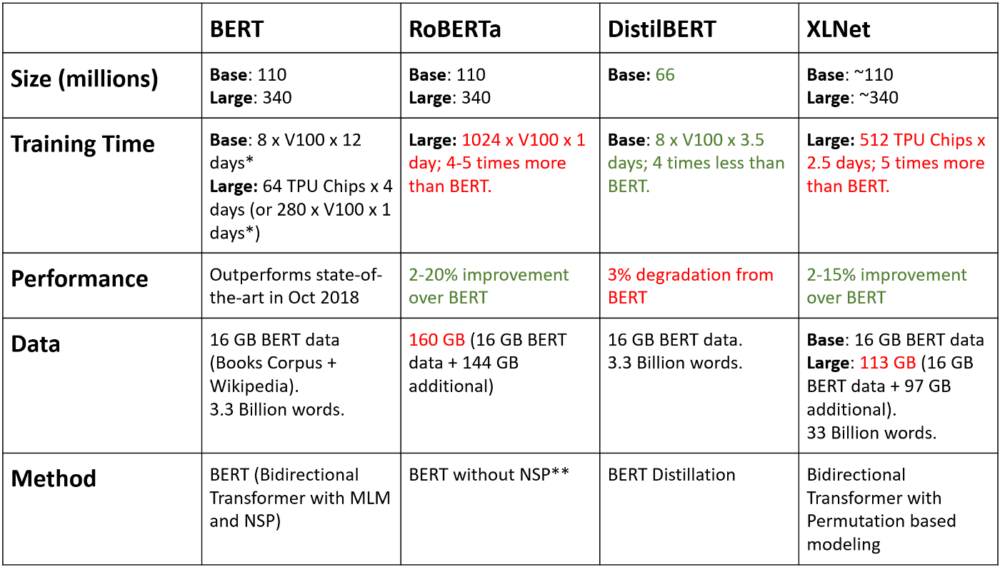

# DistilBERT Encoding and SQuAD Question Answering Model
A study on encoding english sentences to tensorflow vectors or tensors using pre-trained BERT model from the Hugging Face Library.

## Overview 

[BERT](https://arxiv.org/abs/1810.04805) (Bi-directional Encoder representation from Transformers) is a modern language model which can be used for sentence-encoding purposes for a wide variety of applications like sentiment analysis, embeddings, chatbots, text classification, etc. developed by researchers at [Google Language AI](https://research.google/teams/language/). BERT is designed to pre-train deep bidirectional representations from unlabeled text by jointly conditioning on both left and right context in all layers. As a result, the pre-trained BERT model can be fine-tuned with just one additional output layer to create state-of-the-art models for a wide range of tasks. Hence, BERT effectively paves a way for Transfer Learning in the domain of Natural Language Processing.

## BERT Models

We have used the BERT implementations on the popular [HuggingFace Library](https://huggingface.co/)

- [DistillBERT](https://huggingface.co/transformers/model_doc/distilbert.html)
- [RoBERTa](https://huggingface.co/transformers/model_doc/roberta.html)
- General Language Understanding Evaluation ([GLUE](https://gluebenchmark.com/))
- [BERT-base](https://huggingface.co/bert-base-uncased)
- [BERT-large](https://huggingface.co/bert-large-uncased)

### A Timeline of Various BERT Implementations

### A Functional Comparison of Some Modern BERT Implementations

### Fine-tuning BERT 

The pre-training of a BERT model is done by 2 main methods :
- Masked Language Model (MLM)
- Next Sentence Prediction (NSP)

Then, the weights of the pre-tain

We can refer [this paper](https://arxiv.org/pdf/1810.04805.pdf) to learn more about fine-tuning BERT for various specific tasks. 

## Study of BERT Encoding

Here we have studied the uncased [DistilBERT](https://arxiv.org/abs/1910.01108) model in detail, and how to implement it in practice to obtain the standard 768-dimensional feature vectors of any English sentence encoded using the pre-trained model. 

## SQuAD
